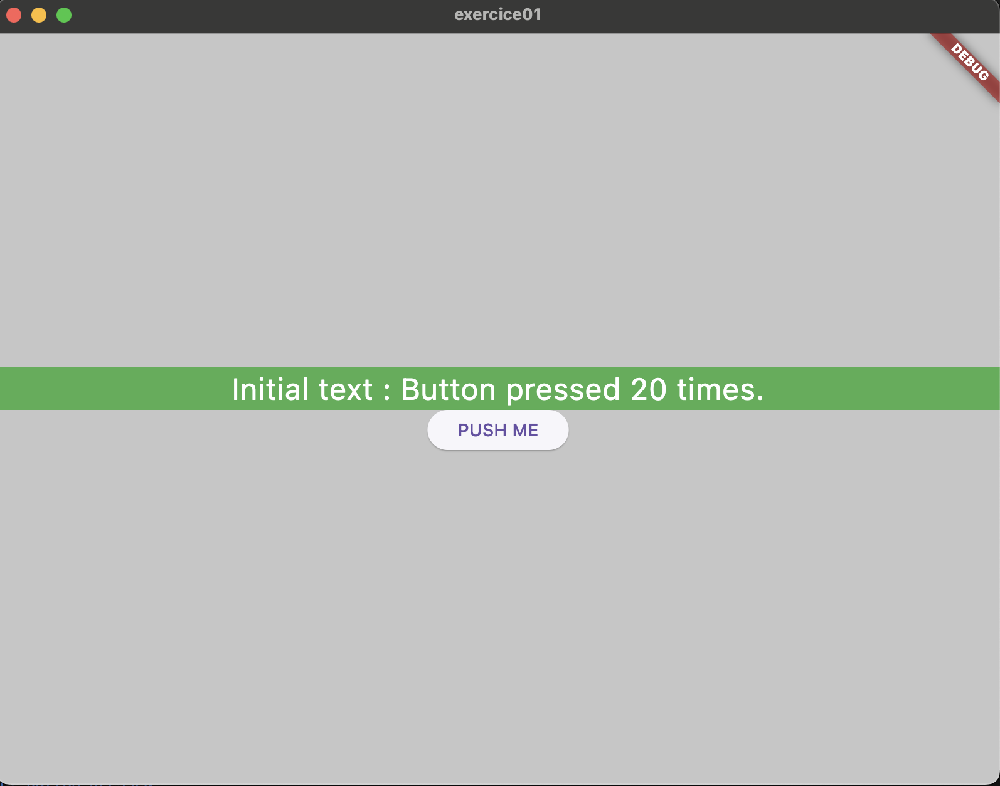

# exercice01

A new Flutter project.

## Getting Started

This exercice has a goal to understand the changing of state when you click on a button. 
What I did :
- Create a boolean to say "if true = 'initial text', if false = 'Hello World'"
- Create a widget which return a text in function if the boolean if true or not
- I optimized the code for the style of the text
- I call the widget in my text container

```c
Widget textDisplay() {
    const textStyle = TextStyle(
      color: Colors.white,
      fontSize: 24,
    );
    return Text(
      isPressed
          ? 'Initial text'
          : 'Hello World',
      style: textStyle,
    );
  }
```

