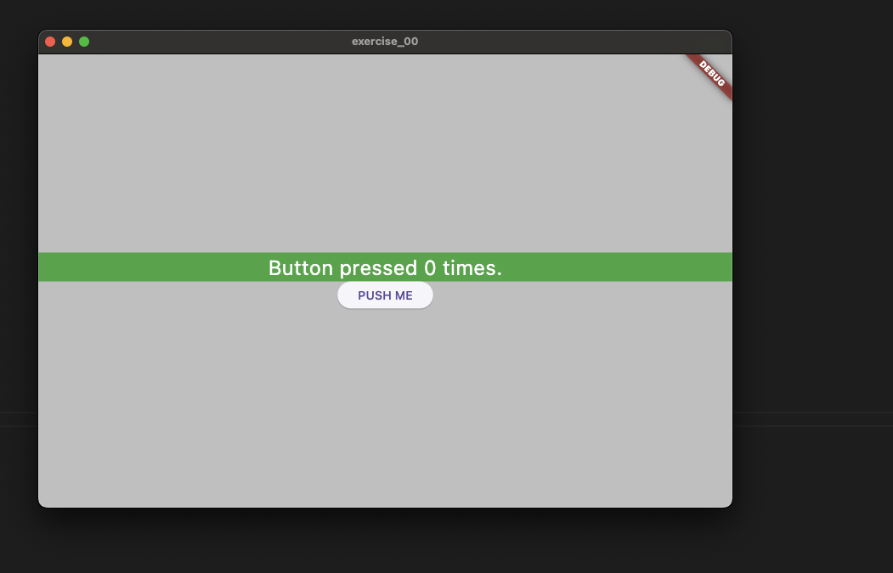

# exercise_00

A new Flutter project.

## Getting Started

The goal of this flutter project is to learn how to:
- Install flutter on your computer 
- Create your first project
- Organize your first renderer in a homepage
- Organize how to display a button a simple text

## Tips 

- Learn how to structure your first project, in the official documentation, you have tutorials [https://docs.flutter.dev/]
- Learn how to build your first app [https://www.youtube.com/watch?v=xWV71C2kp38&t=637s&ab_channel=Flutter]
- Learn what is a state [https://www.youtube.com/watch?v=QlwiL_yLh6E&list=PLjxrf2q8roU3wk7CDw4RfV3mEwOJbjx1k&index=7&ab_channel=Flutter]
- Learn How to organize the layout of your app [https://docs.flutter.dev/ui/layout/tutorial]

